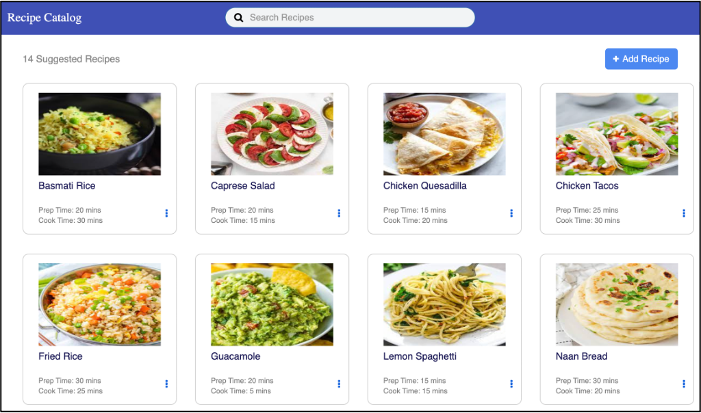

# First Touch
The First Touch Recipe Catalog app is built with Volt MX Go to demonstrate how a Volt MX application can connect back to a Domino application through the Domino Adapter and Domino REST APIs.   The app stores and displays recipe cards of various dishes. Its front-end user interface is created using Volt MX Go Iris, while the Domino database file FirstTouchRecipes.nsf stores the recipe data used by the app. The app is an excellent working example of how data in your Domino database files might be accessed, displayed, and used in different ways and on various devices using Volt MX Go.

For more details please visit https://opensource.hcltechsw.com/voltmxgo-documentation/topicguides/firsttouchapp.htm.

